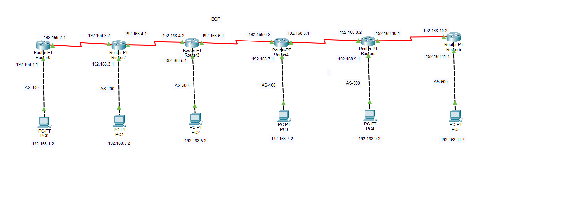
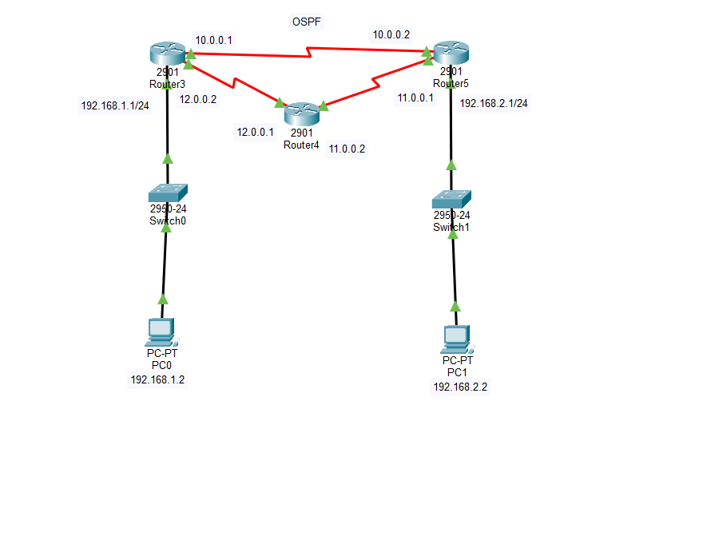
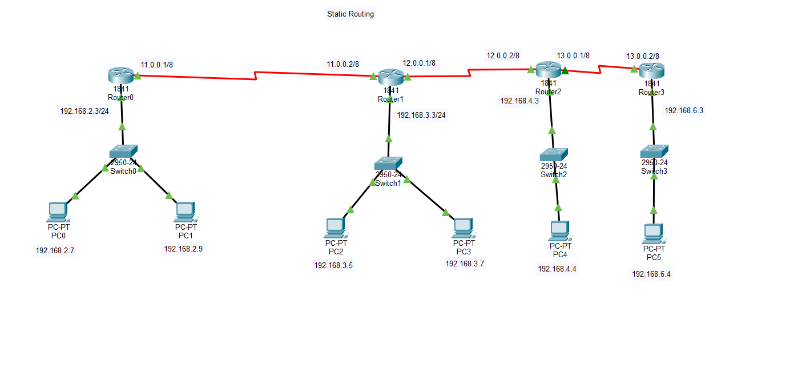

# ISP Edge Peering & Core Routing Architecture
This project showcases how a corporate network connects to the Internet. It demonstrates my ability to configure complex routing protocols used in real-world Enterprise environments.

## What is inside this project?
- **BGP Peering:** Connecting our network to an ISP (Internet Service Provider).
- **OSPF Core:** High-speed internal routing so all office routers can talk to each other.
- **Static Routing:** Manual paths for backup and specific traffic control.

## BGP Topology

*(This shows my router layout and IP addressing scheme)*

## OSPF Topology

*(This shows my router layout and IP addressing scheme)*

## STATIC ROUTING Topology

*(This shows my router layout and IP addressing scheme)*

## Skills Demonstrated
- Configuring eBGP neighbors.
- Setting up OSPF Area 0.
- Managing Routing Tables.
- Network Troubleshooting via CLI.

